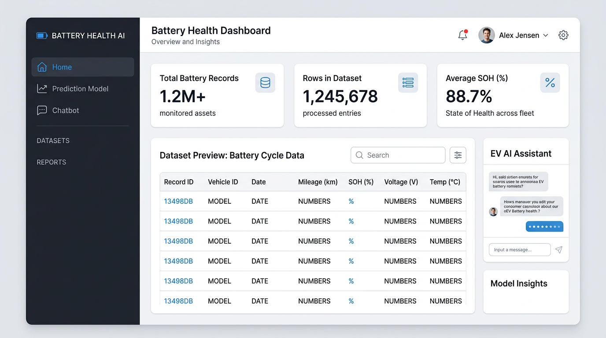
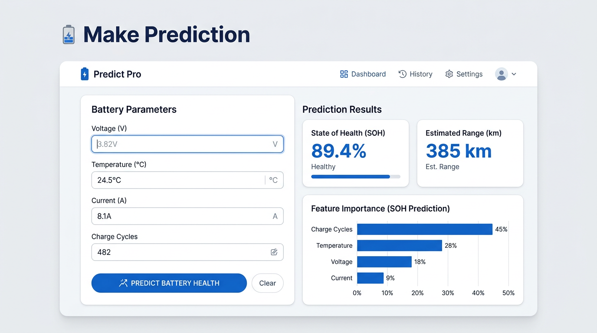
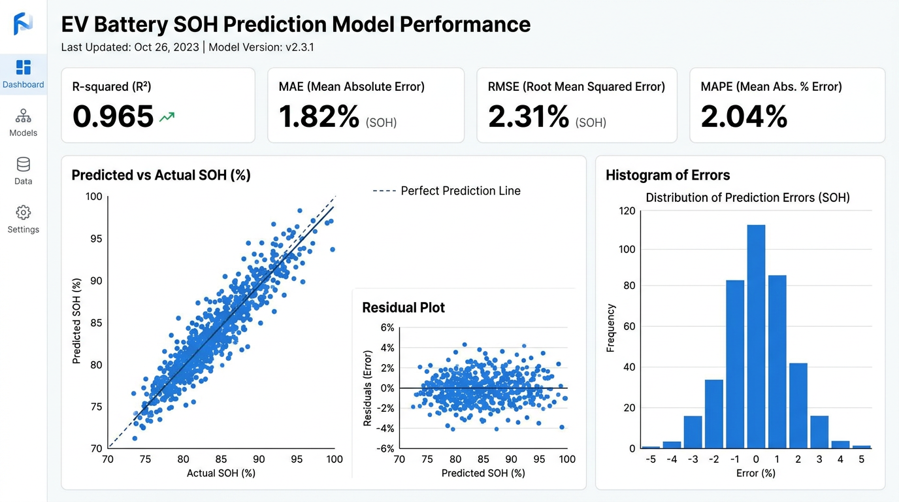
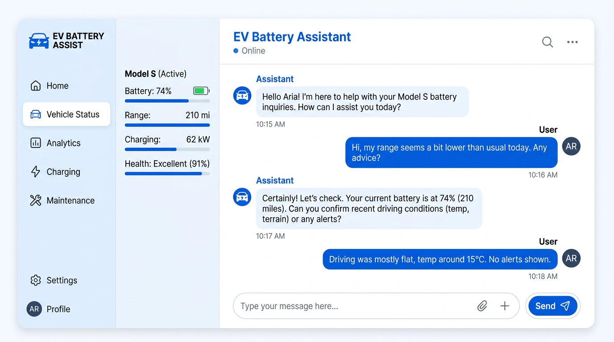
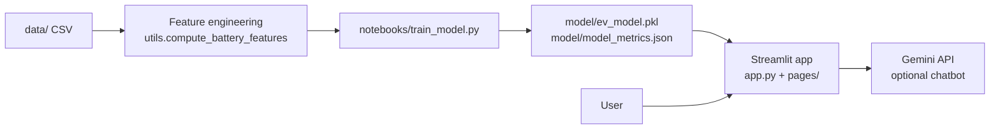

# EV Battery Health & Range Prediction

[](https://github.com/OWNER/REPO/actions)
[](https://www.python.org/downloads/)
[](LICENSE)

A **Streamlit** application that trains and serves a regressor for **State of Health (SOH)** from battery-style telemetry, with optional **Google Gemini** Q&A. Built as a portfolio-grade ML demo: clear layout, tests, Docker, and maintained docs.

> **Disclaimer:** For research and demonstration only—not for vehicle safety, warranty, or regulatory decisions.

<p align="center">
  
</p>

---

## Highlights

| Area | What you get |
|------|----------------|
| **ML** | RandomForest or XGBoost, standardized features, metrics saved with the model |
| **UI** | Multipage Streamlit app (`app.py` + `pages/`), consistent styling |
| **Ops** | `Dockerfile`, `.env.example`, GitHub Actions CI (`pytest`) |
| **Docs** | Screenshots, setup, deployment, environment variables |

---

## Tech stack

Full list of languages, libraries, and tools used in this repository. Logos are provided via [Shields.io](https://shields.io/) + [Simple Icons](https://simpleicons.org/).

### Application & language

<p align="left">
  <a href="https://www.python.org/" title="Python"></a>
  <a href="https://streamlit.io/" title="Streamlit"></a>
</p>

### Data & machine learning

<p align="left">
  <a href="https://pandas.pydata.org/" title="pandas"></a>
  <a href="https://numpy.org/" title="NumPy"></a>
  <a href="https://scikit-learn.org/" title="scikit-learn"></a>
  <a href="https://xgboost.readthedocs.io/" title="XGBoost"></a>
  <a href="https://joblib.readthedocs.io/" title="joblib"></a>
</p>

### Visualization

<p align="left">
  <a href="https://matplotlib.org/" title="Matplotlib"></a>
  <a href="https://seaborn.pydata.org/" title="Seaborn"></a>
</p>

### AI SDK & configuration

<p align="left">
  <a href="https://ai.google.dev/" title="Google Gemini API"></a>
  <a href="https://github.com/theskumar/python-dotenv" title="python-dotenv"></a>
</p>

### Testing & quality

<p align="left">
  <a href="https://pytest.org/" title="pytest"></a>
  <a href="https://github.com/features/actions" title="GitHub Actions"></a>
</p>

### DevOps & deployment

<p align="left">
  <a href="https://www.docker.com/" title="Docker"></a>
</p>

**Also used:** JSON metrics artifacts, `.streamlit` theming, GitHub-hosted CI runners (Ubuntu).

---

## Screenshots

<p align="center">
  <b>Home — data overview</b><br>
  
</p>

<p align="center">
  <b>Prediction — inputs and SOH / range</b><br>
  
</p>

<p align="center">
  <b>Model performance — metrics and plots</b><br>
  
</p>

<p align="center">
  <b>Chatbot — Gemini assistant (optional)</b><br>
  
</p>

> Images are **documentation mockups** representing the app’s layout; replace them with your own screenshots if you need pixel-accurate captures.

---

## Table of contents

- [Tech stack](#tech-stack)
- [Architecture](#architecture)
- [Repository layout](#repository-layout)
- [Quick start](#quick-start)
- [Configuration](#configuration)
- [Training](#training)
- [Testing & quality](#testing--quality)
- [Deployment](#deployment)
- [Troubleshooting](#troubleshooting)
- [License](#license)

---

## Architecture



- **Inputs:** time series–style columns such as `Time`, `Current`, `Voltage`, `Temperature`.
- **Targets / features:** engineered SOH, SOC, cycles, etc. (see `utils.py`).
- **Serving:** model bundle includes scaler, feature names, and JSON metrics.

---

## Repository layout

```
EV/
├── app.py                 # Home entrypoint (Streamlit)
├── pages/                 # Multipage views (Prediction, Performance, Chatbot, About)
├── ev_app/                # Shared UI + session helpers
├── utils.py               # Data, features, model I/O, Gemini helpers
├── notebooks/
│   └── train_model.py     # Train & save model/model_metrics.json
├── model/                 # Trained artifacts (generated)
├── data/                  # Place battery CSVs here
├── tests/                 # pytest suite
├── docs/images/           # README screenshots
├── Dockerfile
├── .env.example
├── .streamlit/config.toml
├── requirements.txt
└── LICENSE
```

---

## Quick start

**Requirements:** Python **3.10+** (3.11 matches the Docker image).

```bash
python -m venv .venv
# Windows: .venv\Scripts\activate
# Linux/macOS: source .venv/bin/activate

pip install -r requirements.txt
copy .env.example .env   # then fill GEMINI_API_KEY if using the chatbot (Windows: copy /Y)
python notebooks/train_model.py
streamlit run app.py
```

Open [http://localhost:8501](http://localhost:8501).

---

## Configuration

| Variable | Purpose |
|----------|---------|
| `GEMINI_API_KEY` | Google AI (Gemini) key for the chatbot |
| `GEMINI_MODEL` | Optional override (default: `gemini-2.0-flash`) |

- **Local:** use `.env` (see `.env.example`) or shell environment variables.
- **Streamlit Cloud:** add secrets in the app dashboard.
- **Never commit** real keys or `secrets.toml`.

---

## Training

```bash
python notebooks/train_model.py
python notebooks/train_model.py --xgboost
python notebooks/train_model.py --test-size 0.25 --random-state 42
```

Outputs:

- `model/ev_model.pkl` — model + scaler + metadata  
- `model/model_metrics.json` — train/test metrics  

---

## Testing & quality

```bash
pytest tests/ -q
```

CI (`.github/workflows/test.yml`) installs dependencies and runs `pytest` on pushes/PRs to `main`/`master`.

**Badge:** Replace `OWNER/REPO` in the shield at the top with your GitHub user/org and repository name after publishing.

---

## Deployment

### Streamlit Community Cloud

1. Push this repo to GitHub.  
2. Create a new app; main file: `app.py`.  
3. Add `GEMINI_API_KEY` (and optional `GEMINI_MODEL`) under **Secrets**.

### Docker

```bash
docker build -t ev-battery-app .
docker run --rm -p 8501:8501 -e GEMINI_API_KEY=your_key ev-battery-app
```

Health check calls Streamlit’s `/_stcore/health` endpoint (see `Dockerfile`).

---

## Troubleshooting

| Issue | What to try |
|--------|-------------|
| No model | Run `python notebooks/train_model.py` |
| No dataset | Add a CSV under `data/` (see column hints in older docs) |
| Chatbot disabled | Set `GEMINI_API_KEY`; install `google-generativeai` |
| Import errors | Activate venv; `pip install -r requirements.txt` |

---

## Contributing

Issues and PRs are welcome. Please keep changes focused, run `pytest`, and update screenshots in `docs/images/` if you materially change the UI.

---

## License

[MIT](LICENSE).

---

## Acknowledgments

- **Libraries:** Streamlit, scikit-learn, XGBoost, pandas, Google Generative AI SDK.  
- **Dataset:** cite your source here when you publish (e.g. lab / paper / Kaggle).
